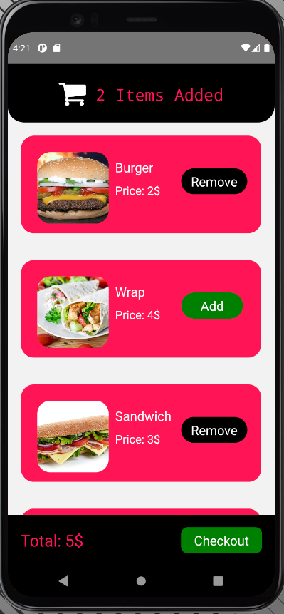

# ReactNativeShoppingCart

A simple shopping cart app made using React Native and Redux. App has just two pages, products and the checkout page. The products page shows all the products in the store and checkout page allows user to modify the quantity of products in the cart. Images are attached below for reference: 

# Products Page
 

# Checkout Page

